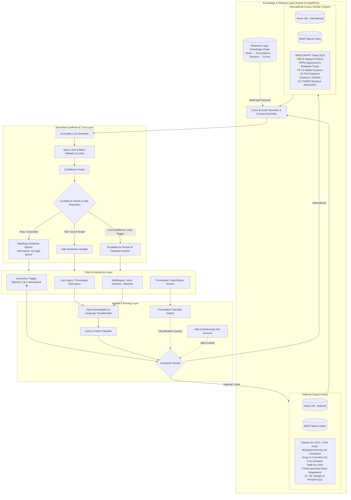
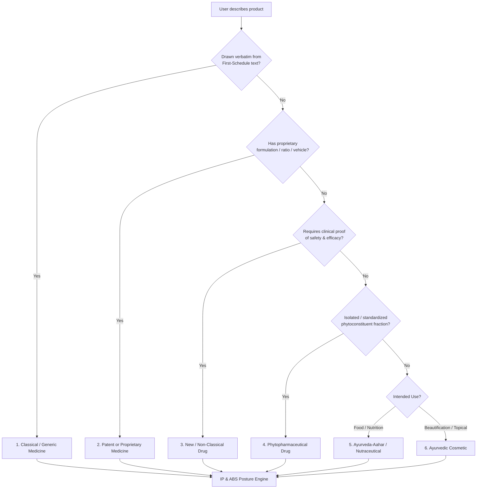
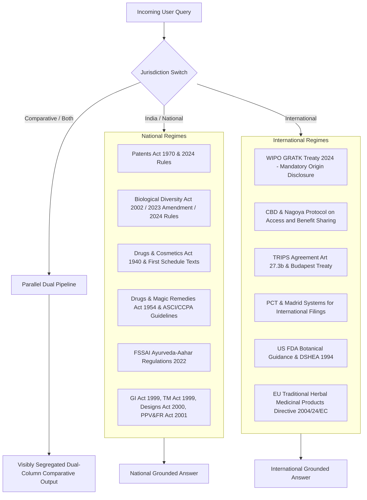
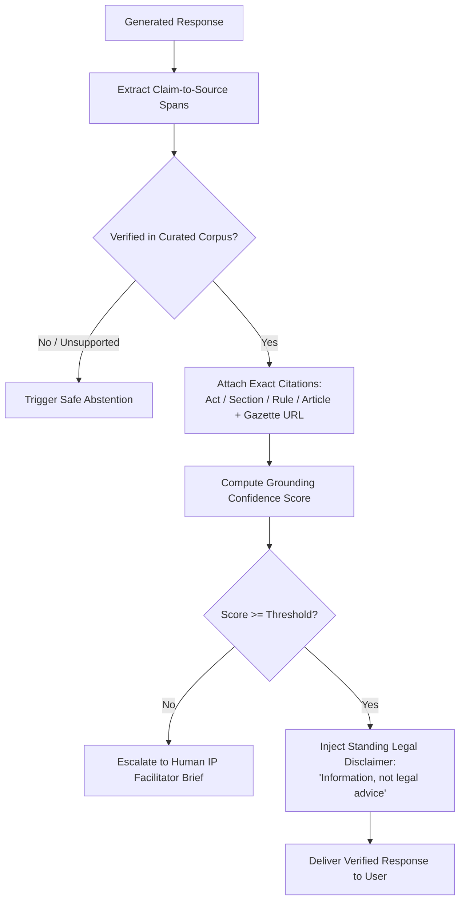

# IP-SAKTI Sahayak — System Architecture

**IP-SAKTI Sahayak** is a multilingual, source-grounded (RAG-based) AI assistant for Intellectual Property (IPR) and regulatory guidance in Ayurveda, operating across distinct National and International legal regimes.

---

## 1. High-Level Architectural Blueprint



---

## 2. Core Subsystems & Components

### 1. Formulation Classification & IP/ABS Posture Engine
Because IPR for Ayurvedic products is intrinsically tied to drug classification, the system executes a 5-step triage decision tree:



#### Category Posture Matrix:
| Category | Governing Regulatory Act | Licensing Authority | Patent Potential & Key Hurdles | ABS & Biodiversity Posture |
|---|---|---|---|---|
| **Classical Medicine** | Drugs & Cosmetics Act 1940 (Chapter IV-A) | State Licensing Authority (SLA) | **Barred under Section 3(p)** as Traditional Knowledge (defended via TKDL). Eligible for Trademarks (Class 5) & GI. | **Exempted** for registered AYUSH practitioners under 2023 BD Amendment Act. Commercial mass-production requires SBB intimation. |
| **Patent or Proprietary (P&P)** | D&C Act 1940 (Rule 158B) | State Licensing Authority (SLA) | Conditional. Must prove **unexpected synergy under Section 3(e)** and therapeutic enhancement under **Section 3(d)**. | SBB prior intimation for Indian entities; NBA Form I approval for foreign entities. |
| **New Drug** | New Drugs and Clinical Trials Rules 2019 | DCGI / CDSCO | High patent potential. Requires Phase I–III clinical trials. | Mandatory NBA Form III clearance prior to patent grant. |
| **Phytopharmaceutical** | New Drugs Rules 2019 / Schedule Y | CDSCO | Strong patentability for novel extraction process, standardized fraction ($\ge 4$ biomarkers). | Mandatory NBA Form I / III approvals and benefit sharing. |
| **Ayurveda-Aahar** | FSSAI Ayurveda Aahar Reg. 2022 | FSSAI | Low patentability. IP centered on Trademarks (Class 29/30) and Trade Dress. **No medicinal cure claims allowed**. | SBB intimation for commercial sourcing of biological food ingredients. |
| **Cosmetic** | Cosmetics Rules 2020 / D&C Act | SLA (Cosmetics Wing) | IP centered on Trademarks (Class 3), Packaging Designs (Designs Act 2000), and Trade Dress. | SBB intimation for commercial sourcing. |

---

## 3. Dual-Jurisdiction Architecture

The system maintains strict segregation between National and International legal corpora so advice is never conflated:



---

## 4. Trust, Source Citation & Guardrails Layer



---

## 5. Phased Evolution Roadmap

```
Phase 1: Architecture & Minimum Working MVP (Current)
├── Clean Scaffolding & Virtual Environment
├── Curated Statutory Corpus (National & International Markdown datasets with 2024 rules)
├── Section-aware Corpus Ingestion & Hybrid BM25/Vector Sliced Retriever
├── 5-Step Formulation Classifier & ABS Engine
├── Grounded RAG Orchestrator with Citation Extractor & Guardrails
├── REST API Layer & Responsive Frontend with Jurisdiction Toggle & Citation Drawer
└── Automated Contract & Flow Test Suite

Phase 2: Relational Legal Knowledge Graph (GraphRAG)
├── Entities: Medicinal Plants, Classical Formulations, Bio-markers, Statutes, Sections, Forms
├── Edges: REQUIRES_ABS, BARS_PATENT_SEC_3P, OVERCOMES_ADMIXTURE, GOVERNED_BY
└── Multi-hop statutory reasoning across acts

Phase 3: Multilingual (Bhashini) & Voice Integration
├── Integration with Bhashini API (IndicTrans2, IndicASR, IndicTTS)
├── Sanskrit/Ayurvedic technical terminology preservation
└── Voice querying for AYUSH MSMEs, practitioners, and cultivators

Phase 4: Official Registry Connectors & Governance
├── Free database pointers (InPASS, Patentscope, TKDL public records, NBA e-filing)
├── 1-Click "IP Facilitator Handoff Dossier" Export (PDF/JSON)
└── DPDP Act 2023 compliance, audit logging & session isolation
```
