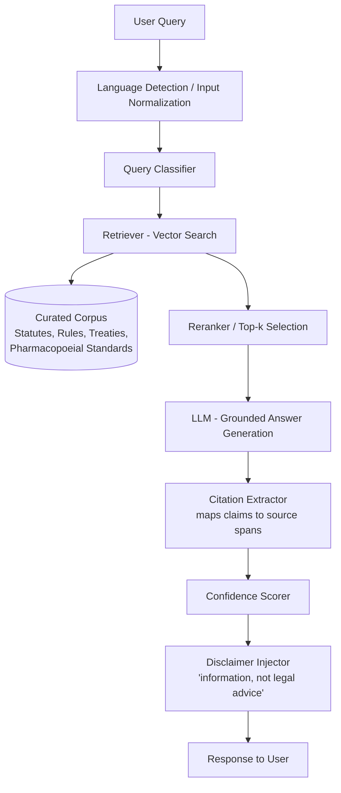
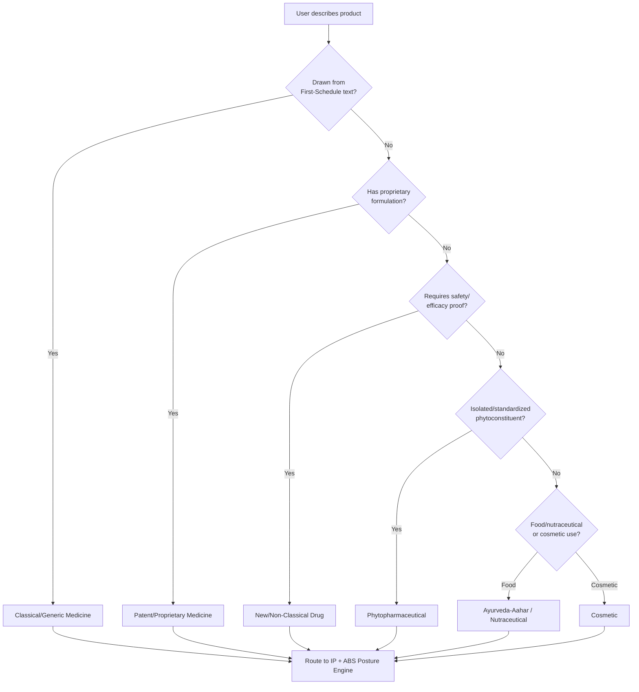
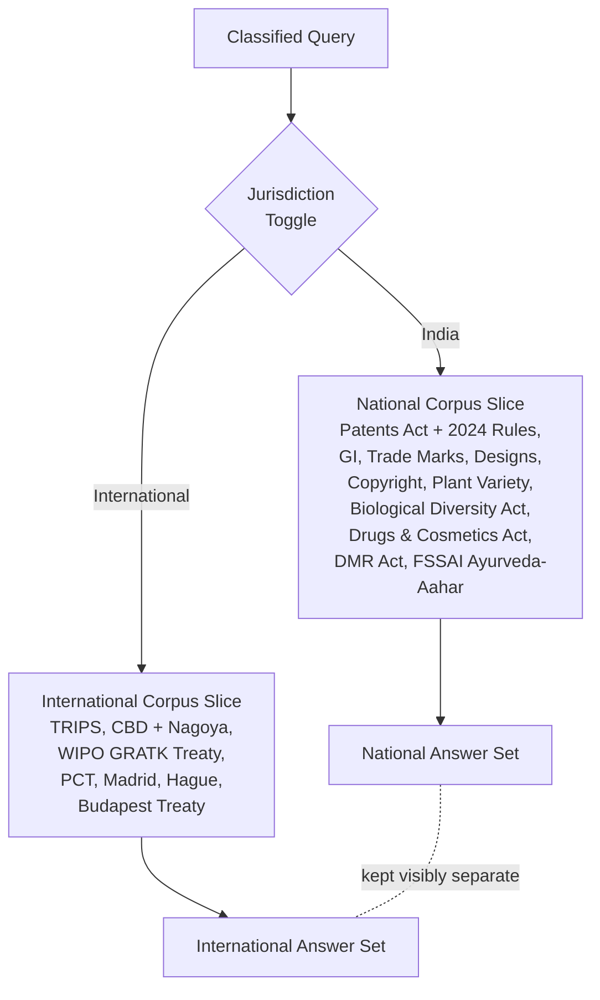
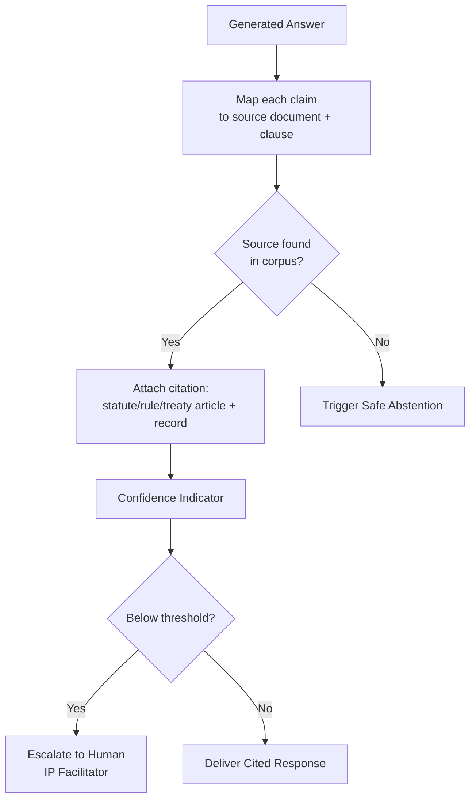
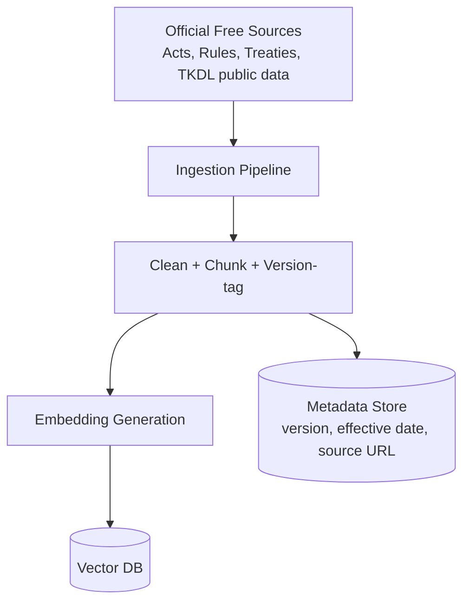
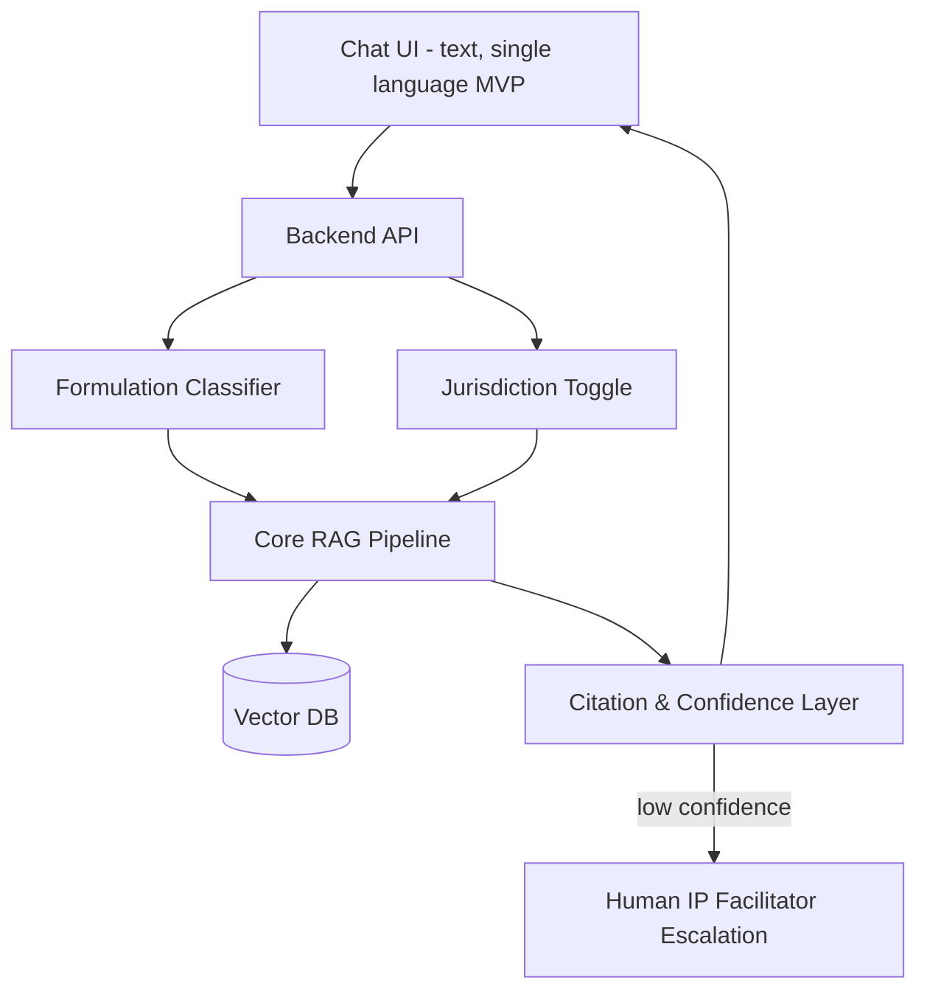

# IP-SAKTI Sahayak — System Architecture (MVP)

Multilingual, RAG-based AI assistant for IP and regulatory guidance in Ayurveda.
This document covers the **MVP architecture only**, broken down by feature.

---

## 1. Core RAG Pipeline (MVP backbone)

---

## 2. Formulation Classification Flow

---

## 3. Jurisdiction Toggle (India vs International)

---

## 4. Source Citation & Trust Layer

---

## 5. Corpus Ingestion (MVP scope only)

---

## 6. Minimal System Overview (how MVP pieces connect)

---

*Future layers (not in MVP): relational knowledge graph, agentic multi-source orchestration, ABS-compliance helper, TKDL/prior-art pointer, paid-source connectors, multilingual delivery (Bhashini), voice interface.*
